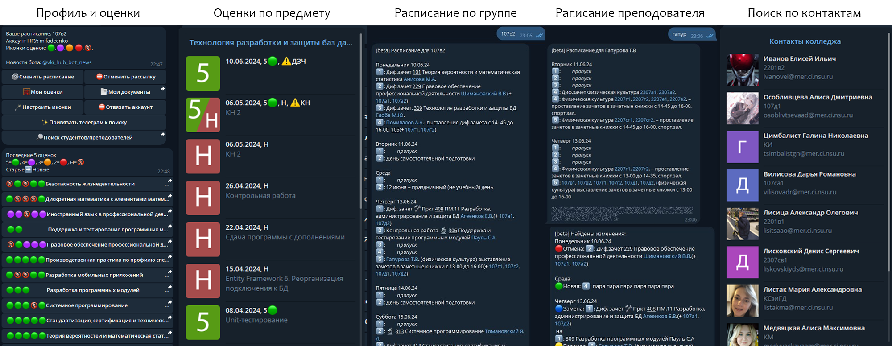
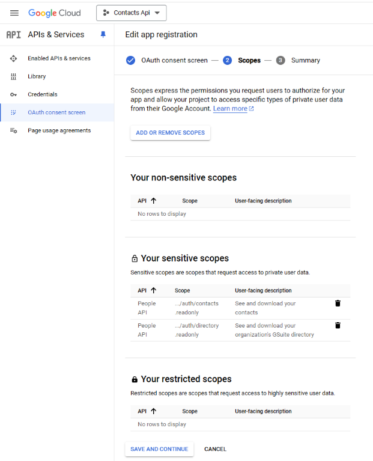

# VKI HUB - бот для оценок и расписания ВКИ НГУ

Бот получает и парсит оценки с сайта вки, оценки из личного кабинета нгу, контакты из google directory, и о всех изменениях уведомляет в telegram. [Бот в телеграм](https://t.me/vki_hub_bot). [Я в телеграм](https://t.me/dedmaxtech)

> [!IMPORTANT]
> Боту очень нужен новый человек который будет следить за ботом и обновлять его (тк я скоро закончу колледж), так что если вы плюс минус понимаете стек (python+aiogram+sqlalchemy+parsing+api), то [жду в лс](https://t.me/dedmaxtech) для обсуждения передачи бота

### Фичи

* Просмотр рендоров расписания с сайта и распаршеного из pdf-ки (можно смотреть расписани по потоку, группе, или фио преподователя)
* Ежедневные уведомления о новом расписании. Если стоит расписание по группе, то подскажет что поменялось в расписании
* Подключения аккаунта cab.nsu.ru для детального просмотра оценок бысто и без перелогина. Также уведомления о новых оценках
* Кастомизация отображения оценок
* Подключен google кабинет ученика, что позволяет прямо из бота искать людей (к примеру, можно найти всех студентов в группе, или по фамилии узнать полное фио преподавателя)
* Если человек привязал аккаунт нгу, то его телеграм будет отображаться в общем поиске для упрощения связи вкишников (по согласию)
* И ещё много мелких приколов...




### TODO

* [ ] Рефакторинг
* * [ ] Вынести из кода строки сообщений
* * [ ] Разобрать алгоритм для парсинга расписания
* * [ ] Нормальные нейминг переменных и почистить неймспейсы
* [ ] Сделать изменения в расписании для преподователей
* [ ] Изменит способ обработки пар-половинок на более гибкий
* [ ] Перестать использовать Imgur для иконок оценок
* [ ] В первоначальной настройке в автоматической установке группы по аккаунту нгу, делать проверку на корректность группы


## Структура проекта

- bot - исходный код бота
  - db - код относящийся к бд
    - migrations - управление миграциями
      - env.py - настройка миграций alembic
      - script.py.mako - шаблон генерации
      - versions - папка со сгенерироваными миграциями
    - models.py - файл с orm моделями
  - handlers - телеграм хэндлеры
    - admin.py - админ панель
    - basic.py - первичная настройка и профиль
    - marks.py - оценки
    - timetable.py - расписание
  - messages - файлы со строками, клавиатурами и состояниями
    - admin.py - для админки
    - basic.py - всё остальное
  - modules - различные файлы с логикой
    - loop.py - главный бесконечный цикл
    - nsu_cab.py - апи для нгу
    - timetable.py - код для парсинга расписания
    - types.py - все типы
  - bot.py - главный файл
  - config.py - все настройкии состояния
  - middlewares.py - мидлвари
  - utils.py - различные утилиты
  - get_auth_token.py - скрипт для получения `auth_token`
- static - статик файлы
  - marks - иконки оценок
  - screenshots - скриншоты для репозитория
- temp - папка для временных файлов (изначально пустая)
  - auth_token.json - токен для получения гугл контактов полученый в `get_auth_token.py`
  - bot.log - лог бота
  - images - temp для рендеров расписания
  - pdf_files - temp для pdf расписания
- venv - виртуальное окружения
- .env - переменные среды
- .env.template - шаблон для файла выше
- alembic.ini - конфиг алембика (ничего менять не надо)
- google_credentials.json - данные google приложения
- README.md - этот файл
- requirements.txt - необходимые библиотеки


## Установка

Необходимые зависимости: Python и Postgres
 
1. Настраиваем виртуальное окружение:

    * Создаём окружение:
    ```sh
    python -m venv venv
    ```

    * Активируем:
    ```sh
    .\venv\Scripts\activate # for windows
    source venv/bin/activate # for linux/macOS 
    ```

    * Устонавливаем зависимости:
    ```sh
    pip install -r requirements.txt
    ```

2. Создаём бд (подставляя свои данные) при помощи `psql` или pgAdmin

    ```sql
    CREATE USER bot WITH PASSWORD 'password';
    CREATE DATABASE botdatabase;
    ALTER DATABASE botdatabase OWNER TO bot;
    GRANT USAGE, CREATE ON SCHEMA public TO bot;
    ```
3. Переименуем `.env.template` в `.env` и заполняем

4. Создаём миграции:

    ```sh
    alembic revision --m="Init_migration" --autogenerate # if models changed
    alembic upgrade head
    ```

5. Для использовния контаков необходимо получить токены

    * Открываем google cloud, создаём новое приложение
    * Открываем вкладку OAuth screen, настраиваем экран, указывания scopes со скриншота ниже 
      
    * Открываем вкладку Credentials, создаём новый данные для desktop app
    * Скачиваем данные, переименовываем в `google_credentials.json`
    * Запускаем `get_auth_token.py`, входим в студенческий гугл аккаунт ИЛИ следуем инструкциям в боте

6. Если будут использоваться автообновления, нужно настроить ссылку для обновления

    ```sh
    git remote set-url origin https://<access_token>@github.com/<username>/<repo>.git
    ```


## Деплой на линуксе

* Выполняем инструкцию выше

* Создаем `/etc/systemd/system/<botname>.service`

```ini
[Unit]
Description=<botname> service
[Service]
Type=simple
Restart=always
WorkingDirectory=/path/to/<botname>/bot
ExecStart=/path/to/<botname>/venv/bin/python3 /path/to/<botname>/bot/bot.py
[Install]
WantedBy=multi-user.target
```

* Включеаем сервис

```sh
sudo systemctl daemon-reload
sudo systemctl enable <botname> # if you want to autostart
sudo systemctl start <botname>
```


